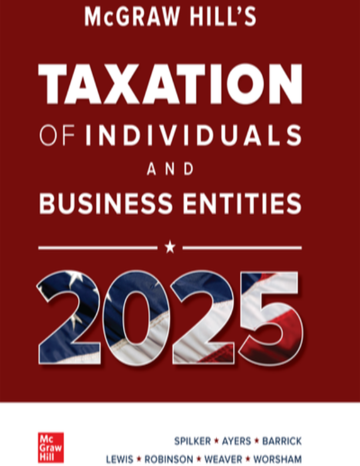

# Federal Taxation

Solving U.S. Federal Tax exercises with Python, using Jupyter Notebooks.

This repo works through the exercises from Taxation of Individuals and Business Entities 2025. The book was written before the One Big Beautiful Act (OBBA), so where it makes sense, I've adapted the exercises to reflect it — using the 2026 U.S. Federal Tax tables.

## Table of Contents
1. [Introduction To Tax](01_An_Introduction_to_Tax/)
2. [Tax Planning Strategies](02_Tax_Planning_Strategies/)
3. [Individual Income Tax Overview, Dependents, and Filing Status](03_Individual_Income_Tax_Overview_Dependents_and_Filing_Status/)
